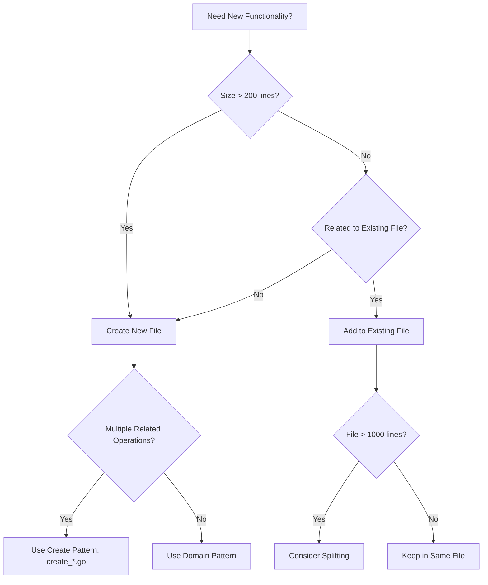
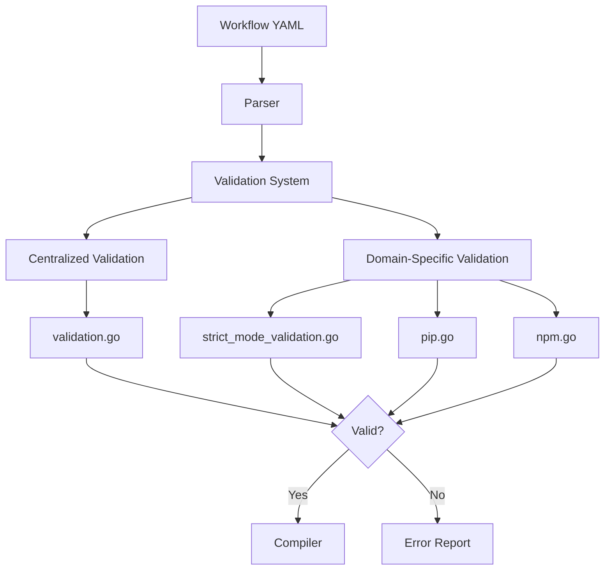
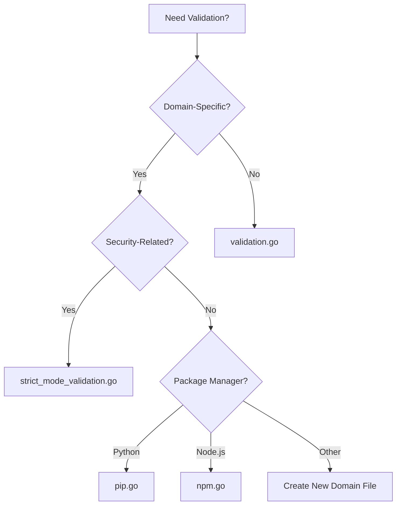
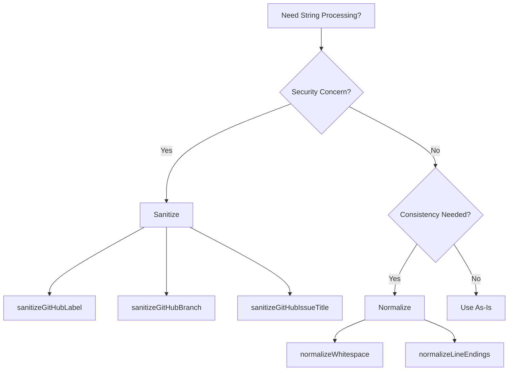
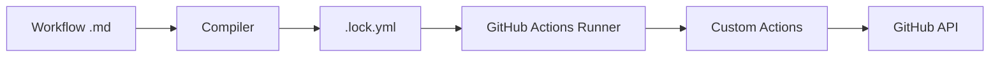

# Developer Instructions

Development guidelines, architectural patterns, and implementation standards for GitHub Agentic Workflows.

---

## Code Organization Patterns

### Recommended Patterns

#### 1. Create Functions Pattern (`create_*.go`)

**Pattern**: One file per GitHub entity creation operation

**Examples**:
- `create_issue.go` - GitHub issue creation logic
- `create_pull_request.go` - Pull request creation logic
- `create_discussion.go` - Discussion creation logic
- `create_code_scanning_alert.go` - Code scanning alert creation
- `create_agent_task.go` - Agent task creation logic

#### 2. Engine Separation Pattern

**Pattern**: Each AI engine has its own file with shared helpers in `engine_helpers.go`

**Examples**:
- `copilot_engine.go` — GitHub Copilot engine
- `claude_engine.go` — Claude engine
- `codex_engine.go` — Codex engine
- `custom_engine.go` — Custom engine support
- `engine_helpers.go` — Shared engine utilities

#### 3. Test Organization Pattern

**Pattern**: Tests live alongside implementation files with descriptive names

**Examples**:
- Feature tests: `feature.go` + `feature_test.go`
- Integration tests: `feature_integration_test.go`
- Specific scenario tests: `feature_scenario_test.go`

### File Creation Decision Tree



### File Size Guidelines

- **Small (50-200 lines)**: Utilities, helpers, simple features
- **Medium (200-500 lines)**: Domain-specific logic, focused features
- **Large (500-1000 lines)**: Complex features, comprehensive implementations
- **Very Large (1000+ lines)**: Consider splitting if not cohesive
---

## Validation Architecture

Validation ensures workflow configurations are correct before compilation. Two patterns:

1. **Centralized validation** — `validation.go`
2. **Domain-specific validation** — dedicated files

### Validation Flow



### Centralized Validation: `pkg/workflow/validation.go`

General-purpose validation across the workflow system:

- `validateExpressionSizes()` — GitHub Actions expression size limits
- `validateContainerImages()` — Docker images exist and are accessible
- `validateRuntimePackages()` — runtime package dependencies
- `validateGitHubActionsSchema()` — GitHub Actions YAML schema
- `validateNoDuplicateCacheIDs()` — unique cache identifiers
- `validateSecretReferences()` — secret reference syntax
- `validateRepositoryFeatures()` — repository capabilities (issues, discussions)

### Domain-Specific Validation

#### Strict Mode: `strict_mode_validation.go`

Enforces security and safety constraints in strict mode:

- `validateStrictMode()` — main strict mode orchestrator
- `validateStrictPermissions()` — refuses write permissions
- `validateStrictNetwork()` — requires explicit network configuration
- `validateStrictMCPNetwork()` — requires network config on custom MCP servers
- `validateStrictBashTools()` — refuses bash wildcard tools

#### Package Validation

- **Python/pip**: `pip.go` — package availability on PyPI
- **Node.js/npm**: `npm.go` — npm packages used with npx

### Where to Add Validation


---

## Development Standards

### Capitalization Guidelines

**Rules**:
- **Product Name**: "GitHub Agentic Workflows" (always capitalize)
- **Feature Names**: Use sentence case (e.g., "safe output messages")
- **File Names**: Use lowercase with hyphens (e.g., `code-organization.md`)
- **Code Elements**: Follow language conventions (e.g., `camelCase` in JavaScript, `snake_case` in Python)
### Breaking Change Rules

**Breaking Changes**:
- Removing or renaming CLI commands, flags, or options
- Changing default behavior that users depend on
- Removing support for configuration formats
- Changing exit codes or error messages that tools parse

**Non-Breaking Changes**:
- Adding new optional flags or commands
- Adding new output formats
- Internal refactoring with same external behavior
- Adding new features that don't affect existing functionality
---

## String Processing

### Sanitize vs Normalize



**Sanitize** — replace characters that cause security issues or break GitHub API constraints:
- `sanitizeGitHubLabel()` — labels meet GitHub requirements (no emoji, length limits)
- `sanitizeGitHubBranch()` — branch names against Git ref rules
- `sanitizeGitHubIssueTitle()` — issue titles avoid problematic characters

**Normalize** — standardize format for consistency, no security implications:
- `normalizeWhitespace()` — whitespace (spaces, tabs, newlines)
- `normalizeLineEndings()` — CRLF to LF
- `normalizeMarkdown()` — markdown formatting
---

## YAML Handling

### YAML 1.1 vs 1.2 Gotchas

**Critical Issue**: GitHub Actions uses YAML 1.1, but many Go YAML libraries default to YAML 1.2

**Key Differences**:
- `on` keyword: YAML 1.1 treats as boolean `true`, YAML 1.2 treats as string
- `yes`/`no`: YAML 1.1 treats as booleans, YAML 1.2 treats as strings
- Octal numbers: Different parsing rules

**Solution**: Use `goccy/go-yaml` library which supports YAML 1.1

```go
import "github.com/goccy/go-yaml"

// Correct YAML 1.1 parsing
var workflow map[string]interface{}
err := yaml.Unmarshal(data, &workflow)
```

**Affected Keywords**:
- Workflow triggers: `on`, `push`, `pull_request`
- Boolean values: `yes`, `no`, `true`, `false`, `on`, `off`
- Null values: `null`, `~`
---

## Safe Output Messages

Structured communication between AI agents and GitHub API operations.

### Message Categories

| Category | Purpose | Footer | Example |
|----------|---------|--------|---------|
| **Issues** | Create/update issues | With issue number | `> AI generated by [Workflow](url) for #123` |
| **Pull Requests** | Create/update PRs | With PR number | `> AI generated by [Workflow](url) for #456` |
| **Discussions** | Create discussions | With discussion number | `> AI generated by [Workflow](url)` |
| **Comments** | Add comments | Context-aware | `> AI generated by [Workflow](url) for #123` |

### Staged Mode Indicator

🎭 marks preview mode across all safe output types.

### Message Structure

```yaml
safe_outputs:
  create_issue:
    title: "Issue title"
    body: |
      ## Description

      Content here

      ---
      > AI generated by [WorkflowName](run_url)
```
---

## Custom GitHub Actions

### Architecture



### Build System

Implemented in Go at `pkg/cli/actions_build_command.go`. No JavaScript build scripts.

**Key Commands**:
- `make actions-build` - Build all custom actions
- `make actions-validate` - Validate action configuration
- `make actions-clean` - Clean build artifacts

**Directory Structure**:
```
actions/
└── setup/
    ├── action.yml
    ├── setup.sh
    ├── js/
    └── sh/
```
---

## Security Best Practices

### Template Injection Prevention

**Key Rule**: Never directly interpolate user input into GitHub Actions expressions or shell commands

**Vulnerable Pattern**:
```yaml
# ❌ UNSAFE - User input in expression
- run: echo "Title: ${{ github.event.issue.title }}"
```

**Safe Pattern**:
```yaml
# ✅ SAFE - Use environment variables
- env:
    TITLE: ${{ github.event.issue.title }}
  run: echo "Title: ${TITLE}"
```

### GitHub Actions Security

**Best Practices**:
- Always pin actions to specific commit SHAs, not tags
- Use minimal permissions with `permissions:` block
- Validate all external inputs
- Never log secrets or tokens
- Use GitHub's OIDC for cloud authentication

**Example**:
```yaml
permissions:
  contents: read
  issues: write
  pull-requests: write

steps:
  - uses: actions/checkout@a1b2c3d4... # Pinned SHA
```
---

## Testing Framework

### Test Types

| Test Type | Purpose | Location | Run Frequency |
|-----------|---------|----------|---------------|
| **Unit Tests** | Test individual functions | `*_test.go` | Every commit |
| **Integration Tests** | Test component interactions | `*_integration_test.go` | Pre-merge |
| **Security Regression Tests** | Prevent security issues | `security_regression_test.go` | Every commit |
| **Fuzz Tests** | Find edge cases | `*_fuzz_test.go` | Continuous |
| **Benchmark Tests** | Performance tracking | `*_benchmark_test.go` | Pre-release |

### Visual Regression Testing

Golden files capture expected console output for tables, boxes, trees, and error formatting.

**Golden Test Commands**:
```bash
# Run golden tests
go test -v ./pkg/console -run='^TestGolden_'

# Update golden files (only when intentionally changing output)
make update-golden
```

**When to Update Golden Files**:
- ✅ Intentionally improving console output formatting
- ✅ Fixing visual bugs in rendering
- ✅ Adding new columns or fields to tables
- ❌ Tests fail unexpectedly during development
- ❌ Making unrelated code changes
---

## Repo-Memory System

Persistent, git-backed storage for AI agents across workflow runs. Maintains state in dedicated git branches with automatic synchronization.

### Architecture Overview

```mermaid
graph TD
    A[Agent Job Start] --> B[Clone memory/{id} branch]
    B --> C[Agent reads/writes files]
    C --> D[Upload artifact: repo-memory-{id}]
    D --> E[Push Repo Memory Job]
    E --> F[Download artifact]
    F --> G[Validate files]
    G --> H[Commit to memory/{id}]
    H --> I[Push to repository]
```

### Path Conventions

| Pattern | Format | Example | Purpose |
|---------|--------|---------|---------|
| **Memory Directory** | `/tmp/gh-aw/repo-memory/{id}` | `/tmp/gh-aw/repo-memory/default` | Runtime directory for agent |
| **Artifact Name** | `repo-memory-{id}` | `repo-memory-default` | GitHub Actions artifact |
| **Branch Name** | `memory/{id}` | `memory/default` | Git branch for storage |

### Data Flow

1. **Clone**: clone `memory/{id}` branch to local directory
2. **Execution**: agent reads/writes files in memory directory
3. **Upload**: upload directory as GitHub Actions artifact
4. **Download**: download artifact and validate constraints
5. **Push**: commit to `memory/{id}` branch and push

### Key Configuration

```yaml
repo-memory:
  - id: default
    create-orphan: true
    allow-artifacts: true

  - id: orchestration
    create-orphan: true
    max-file-size: 1MB
    max-files: 100
```

**Validation Constraints**: max file size, max file count, allowed/blocked patterns, size/count tracking in commit messages.
---

## Hierarchical Agent Management

Meta-orchestrator workflows manage multiple agents and workflows at scale.

### Meta-Orchestrator Roles

| Role | File | Purpose | Schedule |
|------|------|---------|----------|
| **Workflow Health Manager** | `workflow-health-manager.md` | Monitor workflow health | Daily |
| **Agent Performance Analyzer** | `agent-performance-analyzer.md` | Analyze agent quality | Daily |
---

## Release Management

### Changesets

Document changes and manage versioning:

```bash
# Create a changeset
npx changeset

# Release new version
npx changeset version
npx changeset publish
```

**Changeset Format**:
```markdown
---
"gh-aw": patch
---

Brief description of the change
```

**Version Types**:
- **major**: Breaking changes
- **minor**: New features (backward compatible)
- **patch**: Bug fixes and minor improvements

### End-to-End Feature Testing

1. Use `.github/workflows/dev.md` as test workflow
2. Add test scenarios as comments in PR
3. Dev Hawk will analyze and verify behavior
4. Do not merge dev.md changes — it remains a reusable test harness
---

## Scope Hints for Complex Workflows

Provide concrete constraints upfront to avoid agent timeouts and vague output.

### General Rule

> The more constraints you provide upfront, the faster and more accurate the generated workflow.

### Workflow-Type Guidance

| Workflow Type | Key Constraints to Specify |
|---------------|---------------------------|
| **File-parsing** | File format (lcov, cobertura, jacoco, etc.) and path |
| **Cross-branch diff** | Branch strategy (base/head names, e.g. `main`/`feature`) |
| **Reporting** | Output format (markdown, JSON, HTML) |
| **Coverage analysis** | Coverage threshold (e.g. 80%), report location |
| **Dependency audit** | Package manager (npm, pip, cargo), severity filter |
| **Performance benchmarks** | Benchmark tool, metric to track, regression threshold |

### Examples

#### ✅ Constrained (faster, more accurate)

```
Create a workflow that reads an lcov coverage report from `coverage/lcov.info`
and comments on PRs if coverage drops below 80%.
```

```
Create a workflow that diffs `main` and the PR head branch, lists changed
Go files, and posts a markdown summary as a PR comment.
```

```
Create a workflow that runs `npm audit --json`, filters results for
high-severity vulnerabilities, and fails the check if any are found.
```

#### ⚠️ Unconstrained (may cause timeout or vague output)

```
Create a workflow that monitors test coverage.
```

```
Create a workflow that checks for dependency vulnerabilities.
```

```
Create a workflow that compares branches and reports differences.
```

### Timeout Prevention Checklist

Before submitting a complex workflow request, confirm:

- [ ] **Input file path and format** — e.g. `coverage/lcov.info` in lcov format
- [ ] **Triggering event** — e.g. `pull_request`, `push to main`, `schedule`
- [ ] **Success/failure criterion** — e.g. coverage ≥ 80%, zero high-severity CVEs
- [ ] **Output destination** — e.g. PR comment, issue, Slack notification, artifact
- [ ] **Scope boundaries** — e.g. only changed files, only the `src/` directory
---

## PR Deduplication Protocol

Repeated closed PR attempts on the same topic waste CI and context. Run this protocol before every PR.

### Pre-flight Duplicate PR Check

Search for existing closed PRs with a similar topic using the GitHub MCP `search_pull_requests` tool:

1. Extract 2–4 keywords from the feature/fix title.
2. Run a search such as:
   - `is:pr is:closed head:copilot/ <keywords>`
   - `is:pr is:closed <keywords>`
3. If none found, proceed normally.
4. If one or more found, do [Prior Failure Analysis](#prior-failure-analysis) before writing any code.

### Prior Failure Analysis

When a closed PR exists on the same topic, do this at session start — before any code exploration:

1. Read the closed PR description, review comments, and timeline.
2. Identify the **root cause of closure**:
   - Reviewer requested changes → list them explicitly
   - CI/test failures → identify failing checks and root cause
   - Scope mismatch → clarify what was actually requested
   - Duplicate of another fix → link to that fix
3. Verify that the root cause will be addressed in the new implementation.
4. Include a "## Prior Attempts" section in the new PR description that summarizes:
   - Link(s) to prior closed PR(s)
   - Why each was closed
   - What is different this time

**Example PR description section:**

```markdown
## Prior Attempts

- #1234 (closed): CI failed on `TestFoo` due to missing nil check — fixed in this PR
- #1189 (closed): Reviewer requested scope reduction — this PR limits change to X only
```

### Retry Limit Circuit Breaker

If **two or more** closed PRs already exist on the same topic:

1. **Do not open a third PR** without explicit human review.
2. Post a comment on the originating issue that:
   - Lists all prior closed PRs and their close reasons
   - Explains what changed (if anything) in the new approach
   - Requests explicit maintainer approval to proceed
3. Label the issue `copilot-retry-blocked` to signal that human review is required.
4. Wait for a maintainer to remove the label or leave an approving comment before creating the new PR.

**Rationale:** Two consecutive failed PR attempts indicate a systemic problem (unclear requirements, missing context, fundamental design issue) that code changes alone cannot resolve.

---

### File Locations

| Feature | Implementation File | Test File |
|---------|-------------------|-----------|
| Validation | `pkg/workflow/validation.go` | `pkg/workflow/validation_test.go` |
| Safe Outputs | `pkg/workflow/safe_outputs.go` | `pkg/workflow/safe_outputs_test.go` |
| String Processing | `pkg/workflow/strings.go` | `pkg/workflow/strings_test.go` |
| Actions Build | `pkg/cli/actions_build_command.go` | `pkg/cli/actions_build_command_test.go` |
| Schema Validation | `pkg/parser/schemas/` | Various test files |

### Common Patterns

**Creating a new GitHub entity handler**:
1. Create `create_<entity>.go` in `pkg/workflow/`
2. Implement `Create<Entity>()` function
3. Add validation in `validation.go` or domain-specific file
4. Create corresponding test file
5. Update safe output messages

**Adding new validation**:
1. Determine if centralized or domain-specific
2. Add validation function in appropriate file
3. Call from main validation orchestrator
4. Add tests for valid and invalid cases
5. Document validation rules

**Adding new engine**:
1. Create `<engine>_engine.go` in `pkg/workflow/`
2. Implement engine interface
3. Use `engine_helpers.go` for shared functionality
4. Add engine-specific tests
5. Register engine in engine factory

---

**Last Updated**: 2026-04-28
