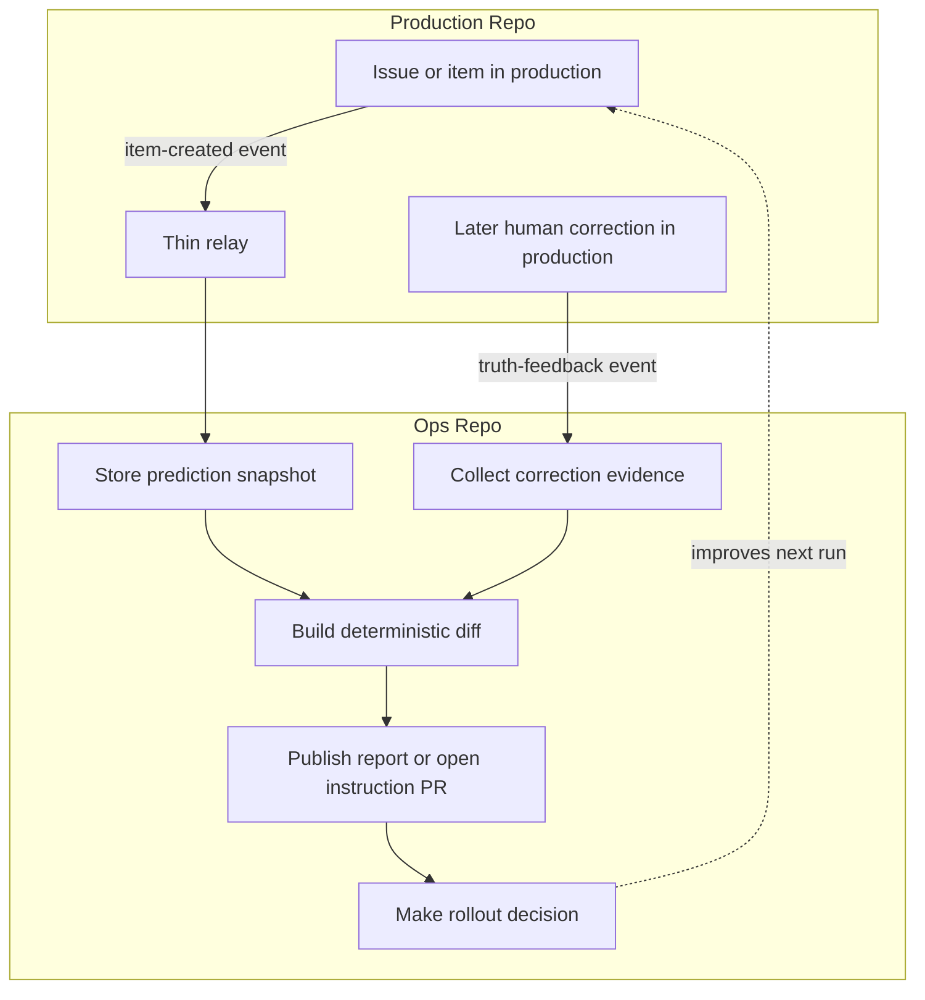

:::caution[Experimental]
CorrectionOps is an experimental pattern. The guidance and workflow shape on this page may change as the pattern is tested in more real-world workflows.
:::

CorrectionOps is a workflow pattern that improves the workflow *around* the model rather than retraining it. It stores predictions at decision time, compares them with later trusted human truth, and uses that evidence to update instructions, routing, thresholds, and rollout decisions.

The basic loop:

1. Save what the workflow predicted
2. Collect what humans later decided
3. Use the difference to improve the workflow

## When to Use CorrectionOps

Use CorrectionOps when humans still make or correct the real decision and you want the workflow to improve iteratively — by updating instructions, routing, thresholds, or rollout state — rather than all at once. Typical fits include labeling and classification, routing and prioritization, moderation and approvals, and summaries or recommendations that humans later correct.

It is especially useful when the rollout path is gradual: start with `staged: true`, keep evaluation and reporting in Ops, use corrections to improve the workflow, and promote to direct writes only when the evidence is strong enough.

## How It Works

A clean CorrectionOps setup has two long-lived surfaces. Production stays authoritative. Ops hosts prediction, correction intake, reporting, instruction updates, and rollout control — early on without writing back to production, later with direct writes once promoted.

Most implementations reduce to three workflow classes: a thin relay that forwards stable facts into ops, a prediction workflow that persists snapshots and writes safely, and a compare/report/decide workflow that checks later human truth and updates the system when the evidence is strong enough.

Keep relays, snapshot resolution, diffing, and grouping deterministic. Use the agent for semantic judgment, not for reconstructing event history or inferring provenance after the fact.

## Example: Issue Labeling



A single CorrectionOps worker can carry the pattern when permissions and triggers fit cleanly together:

```aw wrap
---
on:
  schedule: daily
  workflow_dispatch:
  repository_dispatch:
    types: [truth-feedback]
permissions:
  contents: read
  issues: read
safe-outputs:
  create-issue:
  create-pull-request:
---

# CorrectionOps Worker

Read persisted predictions and later trusted truth, compare them deterministically, then either publish a health report or open a draft PR updating instructions.
```

Unlike Reinforcement Learning from Human Feedback (RLHF), which updates model weights, CorrectionOps changes instruction files, routing rules, deterministic checks, thresholds, or rollout decisions — no separate evaluation repository required.

### Full Workflow Pieces

The example above breaks into four pieces:

#### 1. Relay In The Source Repo

Forwards stable facts and provenance into ops only — no diffs, no human-intent inference, no correctness decisions.

```yaml title="prod-repo/.github/workflows/relay-correction-signals.yml"
name: Relay Correction Signals

on:
  issues:
    types: [opened, labeled, unlabeled]

jobs:
  relay:
    runs-on: ubuntu-latest
    steps:
      - name: Forward stable facts to ops
        uses: actions/github-script@v8
        with:
          github-token: ${{ secrets.OPS_DISPATCH_TOKEN }}
          script: |
            await github.rest.repos.createDispatchEvent({
              owner: 'org',
              repo: 'ops-repo',
              event_type: context.payload.action === 'opened' ? 'item-created' : 'truth-feedback',
              client_payload: {
                data: {
                  source_repository: `${context.repo.owner}/${context.repo.repo}`,
                  source_type: 'issue',
                  item_number: context.payload.issue.number,
                  item_title: context.payload.issue.title,
                  item_url: context.payload.issue.html_url,
                  event_type: context.payload.action,
                  label: context.payload.label?.name || null,
                  actor: context.actor,
                  actor_type: context.actor.endsWith('[bot]') ? 'bot' : 'human',
                  occurred_at: new Date().toISOString(),
                },
              },
            });
```

#### 2. Prediction Workflow In Ops

Consumes normalized inputs, applies the current instructions, and persists a durable snapshot for later comparison.

```aw wrap title="ops-repo/.github/workflows/predict-items.md"
---
name: Predict Items

on:
  schedule: daily
  workflow_dispatch:
  repository_dispatch:
    types: [item-created]

tools:
  github:
    toolsets: [issues, repos]

safe-outputs:
  create-issue:
  update-issue:
---

# Predict Items

Read prepared items from `/tmp/gh-aw/agent/item-scan`, apply the current instructions, write review artifacts through safe outputs in Ops, and append a prediction snapshot containing the source identifier, predicted action, instruction version, and timestamp.
```

#### 3. Compare, Report, And Decide In Ops

Reads predictions and later human truth, builds deterministic diffs first, then asks the agent to summarize patterns or propose instruction updates.

```aw wrap title="ops-repo/.github/workflows/review-corrections.md"
---
name: Review Corrections

on:
  schedule: weekly
  workflow_dispatch:
    inputs:
      mode:
        description: report or adaptation
        required: false
        default: report
        type: choice
        options: [report, adaptation]

safe-outputs:
  create-issue:
  create-pull-request:
---

# Review Corrections

Read `correction-diffs.json` from `/tmp/gh-aw/agent/correction-review`. In `report` mode, publish a health summary. In `adaptation` mode, open a draft PR updating the instruction file only when the grouped evidence is strong enough.
```

#### 4. Optional Deterministic Collector

Add a separate collector when the later-truth boundary needs its own trigger, permissions, or serialized write path.

```yaml title="ops-repo/.github/workflows/collect-corrections.yml"
name: Collect Corrections

on:
  repository_dispatch:
    types: [truth-feedback]

jobs:
  collect:
    runs-on: ubuntu-latest
    steps:
      - name: Resolve authoritative truth and store correction evidence
        run: ./scripts/store-correction-evidence.sh
```

### Stable Contracts To Define First

Before adding rollout logic or adaptation prompts, define four small deterministic contracts:

1. relay payload: the minimal source identity, object identity, event type, actor facts, and timestamps forwarded into ops
2. prediction snapshot: the durable record of what the workflow predicted and under which instruction version
3. correction review input: the deterministic diff artifact used by reporting and adaptation
4. rollout gate contract: what evidence or approvals are required before direct production writes are enabled

The production object changes across use cases, but the CorrectionOps shape does not.

## Related Documentation

- [Staged Mode](/gh-aw/reference/staged-mode/) for the optional safe-write rollout guidance inside CorrectionOps
- [SideRepoOps](/gh-aw/patterns/side-repo-ops/) for separating workflow infrastructure from the production repository
- [MultiRepoOps](/gh-aw/patterns/multi-repo-ops/) for coordinating workflows across repository boundaries
- [Safe Outputs Reference](/gh-aw/reference/safe-outputs/) for controlling write targets and protections
- [GitHub Tools](/gh-aw/reference/github-tools/) for cross-repository reads and operations
