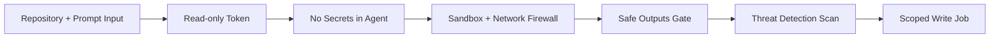

import { Card, CardGrid } from '@astrojs/starlight/components';
import FeatureCard from '../../components/FeatureCard.astro';
import FeatureGrid from '../../components/FeatureGrid.astro';
import Video from '../../components/Video.astro';
import BlogLinkSection from '../../components/BlogLinkSection.astro';

Wake up to ready-to-review repository improvements—automated triage, CI insights, docs updates, and test enhancements from simple markdown workflows.

GitHub Agentic Workflows deliver this: repository automation, running the coding agents you know and love, in GitHub Actions, with strong guardrails and security-first design principles.

Use GitHub Copilot, Claude by Anthropic, Gemini from Google or OpenAI Codex for event-triggered and scheduled jobs to improve your repository. GitHub Agentic Workflows [augment](https://github.github.com/gh-aw/reference/faq/#determinism) your existing, deterministic CI/CD with [Continuous AI](https://githubnext.com/projects/continuous-ai) capabilities.

Developed by GitHub and Microsoft, workflows run with added guardrails, using safe outputs and sandboxed execution to help keep your repository safe.

> ⓘ Note: GitHub Agentic Workflows is in early development and may change significantly. Using agentic workflows requires careful attention to security considerations and careful human supervision, and even then things can still go wrong. Use it with caution, and at your own risk.

## Key Features

<FeatureGrid columns={3}>
  <FeatureCard icon="pencil" title="Automated Markdown Workflows" href="/gh-aw/introduction/overview/#natural-language-to-github-actions">
    Write automation in markdown instead of complex YAML
  </FeatureCard>
  <FeatureCard icon="cpu" title="AI-Powered Decision Making" href="/gh-aw/introduction/how-they-work/">
    Workflows that understand context and adapt to situations
  </FeatureCard>
  <FeatureCard icon="mark-github" title="GitHub Integration" href="/gh-aw/reference/github-tools/">
    Deep integration with Actions, Issues, PRs, Discussions, and repository management
  </FeatureCard>
  <FeatureCard icon="shield-lock" title="Safety First" href="/gh-aw/introduction/architecture/">
    Sandboxed execution with minimal permissions and safe output processing
  </FeatureCard>
  <FeatureCard icon="beaker" title="Multiple AI Engines" href="/gh-aw/reference/engines/">
    Support for Copilot, Claude, Codex, and custom AI processors
  </FeatureCard>
  <FeatureCard icon="workflow" title="Continuous AI" href="/gh-aw/introduction/how-they-work/">
    Systematic, automated application of AI to software collaboration
  </FeatureCard>
</FeatureGrid>

## Guardrails Built-In

AI agents can be manipulated by prompt injection, malicious repository content, or compromised tools. GitHub Agentic Workflows uses layered controls to keep each run contained: sandboxing limits where code can execute, scoped permissions limit what it can request, and gated outputs ensure only approved actions reach GitHub.



<CardGrid>
  <Card title="Read-only token">
    The agent can read repository state, but it cannot
    push commits or write to issues directly.
  </Card>
  <Card title="No secrets in agent runtime">
    Sensitive credentials stay in isolated downstream
    jobs, not inside the agent process.
  </Card>
  <Card title="Sandbox + network firewall">
    The agent runs in a container behind the
    [Agent Workflow Firewall](/gh-aw/introduction/architecture/#agent-workflow-firewall-awf)
    and can only reach allowed destinations.
  </Card>
  <Card title="Safe outputs gate">
    Requested actions are validated against your
    configured [safe outputs](/gh-aw/reference/safe-outputs/)
    policy before anything is applied.
  </Card>
  <Card title="Threat detection">
    A dedicated
    [threat detection job](/gh-aw/reference/threat-detection/)
    scans proposed outputs and blocks suspicious changes.
  </Card>
</CardGrid>

See the [Security Architecture](/gh-aw/introduction/architecture/) for a full breakdown of the layered defense-in-depth model.

## Manage Cost and Capacity

Cost control starts with visibility. Use `gh aw logs` and `gh aw audit` to find runs consuming the most time, tokens, and AI Credits (AIC), then tighten prompts, triggers, and model choices before spend drifts upward.

`max-effective-tokens` gives each run a hard budget, while [OpenTelemetry](/gh-aw/reference/open-telemetry/) exports traces and token data to OTLP backends for dashboards, alerting, and cost analysis. For optimization over time, compare cost with [outcomes](/gh-aw/reference/outcomes/) so lower spend still produces useful accepted results.

<FeatureGrid columns={3}>
  <FeatureCard icon="pulse" title="Cost Management" href="/gh-aw/reference/cost-management/">
    Track Actions minutes, inference spend, and the heaviest runs before deciding what to optimize
  </FeatureCard>
  <FeatureCard icon="workflow" title="OpenTelemetry" href="/gh-aw/reference/open-telemetry/">
    Export workflow traces to OTLP backends for dashboards, alerts, and spend analysis
  </FeatureCard>
  <FeatureCard icon="tools" title="Effective Token Budgets" href="/gh-aw/reference/frontmatter/#effective-token-budget-max-effective-tokens">
    Cap runaway runs with max-effective-tokens and optimize around effective-token usage
  </FeatureCard>
</FeatureGrid>

## Example: Daily Issues Report

Here's a simple workflow that runs daily to create an upbeat status report:

```markdown
---
on:
  schedule: daily

permissions:
  contents: read
  issues: read
  pull-requests: read

safe-outputs:
  create-issue:
    title-prefix: "[team-status] "
    labels: [report, daily-status]
    close-older-issues: true
---

## Daily Issues Report

Create an upbeat daily status report for the team as a GitHub issue.

## What to include

- Recent repository activity (issues, PRs, discussions, releases, code changes)
- Progress tracking, goal reminders and highlights
- Project status and recommendations
- Actionable next steps for maintainers

```

The `gh aw` cli hardens this to a traditional GitHub Actions Workflow (.lock.yml) that runs an AI coding agent (Copilot CLI, Claude Code, Codex, ...) in a containerized environment on a schedule or manually. The AI coding agent reads your repository context, analyzes issues, generates visualizations, and creates reports. All defined in natural language rather than complex code.

## Gallery

<FeatureGrid columns={3}>
  <FeatureCard icon="issue-opened" title="Issue & PR Management" href="/gh-aw/blog/2026-01-13-meet-the-workflows-issue-management/">
    Automated triage, labeling, and project coordination
  </FeatureCard>
  <FeatureCard icon="book" title="Continuous Documentation" href="/gh-aw/blog/2026-01-13-meet-the-workflows-documentation/">
    Continuous documentation maintenance and consistency
  </FeatureCard>
  <FeatureCard icon="code-review" title="Continuous Improvement" href="/gh-aw/blog/2026-01-13-meet-the-workflows-continuous-simplicity/">
    Daily code simplification, refactoring, and style improvements
  </FeatureCard>
  <FeatureCard icon="pulse" title="Metrics & Analytics" href="/gh-aw/blog/2026-01-13-meet-the-workflows-metrics-analytics/">
    Daily reports, trend analysis, and workflow health monitoring
  </FeatureCard>
  <FeatureCard icon="tools" title="Quality & Testing" href="/gh-aw/blog/2026-01-13-meet-the-workflows-quality-hygiene/">
    CI failure diagnosis, test improvements, and quality checks
  </FeatureCard>
  <FeatureCard icon="repo" title="Multi-Repository" href="/gh-aw/examples/multi-repo/">
    Feature sync and cross-repo tracking workflows
  </FeatureCard>
</FeatureGrid>

## Getting Started

Install the extension, add a sample workflow, and trigger your first run - all from the command line in minutes.

<Video
  src="/gh-aw/videos/install-and-add-workflow-in-cli.mp4"
  title="Install and add workflow in CLI demo video"
  captionsSrc="/gh-aw/videos/install-and-add-workflow-in-cli.vtt"
  aspectRatio="16:9"
/>

## Creating Workflows

Create custom agentic workflows directly from the GitHub web interface using natural language.

<Video
  src="/gh-aw/videos/create-workflow-on-github.mp4"
  title="Create workflow on GitHub demo video"
  captionsSrc="/gh-aw/videos/create-workflow-on-github.vtt"
  aspectRatio="16:9"
/>
