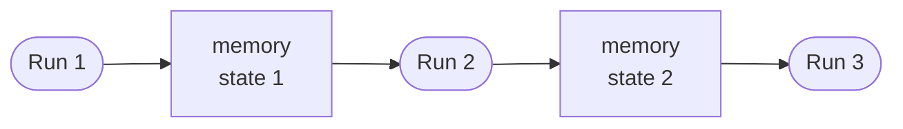

MemoryOps is a set of patterns for using [Cache Memory](/gh-aw/reference/cache-memory/) and [Repo Memory](/gh-aw/reference/repo-memory/) to persist state across workflow runs. Use memory to record progress, resume after interruptions, share data between workflows, support incremental processing, analyze trends, and coordinate multi-step tasks.



When prompting agents to use memory, high-level descriptions are often enough. You usually do not need to define a schema up front: the first run can write a practical structure, and later runs can read and evolve it as needed. That flexibility makes memory useful for stateful workflows without rigid schemas.

## Memory Types

Three memory stores are available:

| Type | Best for | Example | Default path |
| --- | --- | --- | --- |
| [Cache Memory](/gh-aw/reference/cache-memory/) | Temporary state, session data, short-term caching | `tools.cache-memory.key: my-workflow-state` | `/tmp/gh-aw/cache-memory/` |
| [Repo Memory](/gh-aw/reference/repo-memory/) | Historical data, trend tracking, long-lived state | `tools.repo-memory.branch-name: memory/my-workflow` | `/tmp/gh-aw/repo-memory/default/` |
| [Comment Memory](/gh-aw/reference/frontmatter-full/) | PR or issue follow-up context, review history, iterative updates | `tools.comment-memory.target: triggering` | `/tmp/gh-aw/comment-memory/` |

Cache Memory uses GitHub Actions cache with 7-day retention. Repo Memory stores files in a dedicated Git branch. Comment Memory stores state in a managed issue or PR comment and updates it over time.

```yaml
tools:
  cache-memory:
    key: my-workflow-state

  repo-memory:
    branch-name: memory/my-workflow
    file-glob: ["*.json", "*.jsonl"]

  comment-memory:
    target: triggering  # Use the issue/PR that triggered this workflow run
```

## Pattern 1: Exhaustive Processing

Track progress through large datasets with todo/done lists to ensure complete coverage across multiple runs.

```markdown
Analyze all open issues in the repository. Track your progress in cache-memory
so you can resume if the workflow times out. Mark each issue as done after
processing it. Generate a final report with statistics.
```

The agent maintains a state file with items to process and completed items, updating it after each item so the workflow can resume if interrupted:

```json
{
  "todo": [123, 456, 789],
  "done": [101, 102],
  "errors": [],
  "last_run": 1705334400
}
```

Real examples: `.github/workflows/repository-quality-improver.md`, `.github/workflows/copilot-agent-analysis.md`

## Pattern 2: State Persistence

Save workflow checkpoints to resume long-running tasks that may timeout.

```markdown
Migrate 10,000 records from the old format to the new format. Process 500
records per run and save a checkpoint. Each run should resume from the last
checkpoint until all records are migrated.
```

The agent stores a checkpoint with the last processed position and resumes from it each run:

```json
{
  "last_processed_id": 1250,
  "batch_number": 13,
  "total_migrated": 1250,
  "status": "in_progress"
}
```

Real examples: `.github/workflows/daily-news.md`, `.github/workflows/cli-consistency-checker.md`

## Pattern 3: Shared Information

Share data between workflows using [repo-memory](/gh-aw/reference/repo-memory/) branches. A producer workflow stores data; consumers read it using the same branch name.

*Producer workflow:*
```markdown
Every 6 hours, collect repository metrics (issues, PRs, stars) and store them
in repo-memory so other workflows can analyze the data later.
```

*Consumer workflow:*
```markdown
Load the historical metrics from repo-memory and compute weekly trends.
Generate a trend report with visualizations.
```

Both workflows reference the same branch:

```yaml
tools:
  repo-memory:
    branch-name: memory/shared-data
```

Real examples: `.github/workflows/metrics-collector.md` (producer), trend analysis workflows (consumers)

## Pattern 4: Data Caching

Cache API responses to avoid rate limits and reduce workflow time. Check for fresh cached data before making API calls. A reasonable starting point is repository metadata (24h), contributor lists (12h), issues and PRs (1h), and workflow runs (30m).

```markdown
Fetch repository metadata and contributor lists. Cache the data for 24 hours
to avoid repeated API calls. If the cache is fresh, use it. Otherwise, fetch
new data and update the cache.
```

Real examples: `.github/workflows/daily-news.md`

## Pattern 5: Trend Computation

Store time-series data and compute trends, moving averages, and statistics. The agent appends new data points to a JSON Lines history file and computes trends using Python.

```markdown
Collect daily build times and test times. Store them in repo-memory as
time-series data. Compute 7-day and 30-day moving averages. Generate trend
charts showing whether performance is improving or declining over time.
```

Real examples: `.github/workflows/daily-code-metrics.md`, `.github/workflows/shared/charts-with-trending.md`

## Pattern 6: Multiple Memory Stores

Use multiple memory instances for different lifecycles — cache-memory for temporary session data, separate repo-memory branches for metrics, configuration, and archives.

```markdown
Use cache-memory for temporary API responses during this run. Store daily
metrics in one repo-memory branch for trend analysis. Keep data schemas in
another branch. Archive full snapshots in a third branch with compression.
```

```yaml
tools:
  cache-memory:
    key: session-data  # Fast, temporary

  repo-memory:
    - id: metrics
      branch-name: memory/metrics  # Time-series data

    - id: config
      branch-name: memory/config  # Schema and metadata

    - id: archive
      branch-name: memory/archive  # Compressed backups
```

## Pattern 7: PR Comment Memory

Use comment memory to keep task state in the pull request discussion, so each run can continue with the latest context from the PR itself.

```markdown
Review this pull request in passes. Store the running checklist, unresolved
questions, and follow-up tasks in comment memory so each new run continues from
the previous review state.
```

```yaml
tools:
  comment-memory:
    target: triggering
    memory-id: pr-review-state  # Separate state bucket in the managed comment
```

This works well for PRs that need multiple review cycles because state stays attached to the PR. Use a stable `memory-id` so repeated runs update the same state file at `/tmp/gh-aw/comment-memory/<memory-id>.md`; changing the `memory-id` writes to a different file instead.

## Best Practices

- Use JSON Lines for append-only logs and time-series data.
- Include lightweight metadata so later runs can understand the structure.
- Rotate old data to prevent unbounded growth.

```bash
# Append without reading entire file
echo '{"date": "2024-01-15", "value": 42}' >> data.jsonl

# Keep only last 90 entries
tail -n 90 history.jsonl > history-trimmed.jsonl
mv history-trimmed.jsonl history.jsonl
```

```json
{
  "dataset": "performance-metrics",
  "schema": {
    "date": "YYYY-MM-DD",
    "value": "integer"
  },
  "retention": "90 days"
}
```

## Security Considerations

Memory stores are visible to anyone with repository access. Never store credentials, API tokens, PII, or secrets — only aggregate statistics and anonymized data.

```bash
# ✅ GOOD - Aggregate statistics
echo '{"open_issues": 42}' > metrics.json

# ❌ BAD - Individual user data
echo '{"user": "alice", "email": "alice@example.com"}' > users.json
```

## Troubleshooting

- **Cache not persisting**: Verify the cache key is consistent across runs.
- **Repo memory not updating**: Check that `file-glob` matches your files and that they stay within the `max-file-size` limit.
- **Out of memory errors**: Process data in chunks instead of loading everything at once, and rotate old data.
- **Merge conflicts**: Prefer append-only JSON Lines, separate branches per workflow, or include the run ID in filenames.

## Related Documentation

- [Cache Memory](/gh-aw/reference/cache-memory/) — Full cache-memory reference
- [Repository Memory](/gh-aw/reference/repo-memory/) — Full repo-memory reference
- [MCP Servers](/gh-aw/guides/mcps/) - Memory MCP server configuration
- [DeterministicOps](/gh-aw/patterns/deterministic-ops/) - Data preprocessing and extraction
- [Safe Outputs](/gh-aw/reference/custom-safe-outputs/) - Storing workflow outputs
- [Frontmatter Reference](/gh-aw/reference/frontmatter/) - Configuration options
